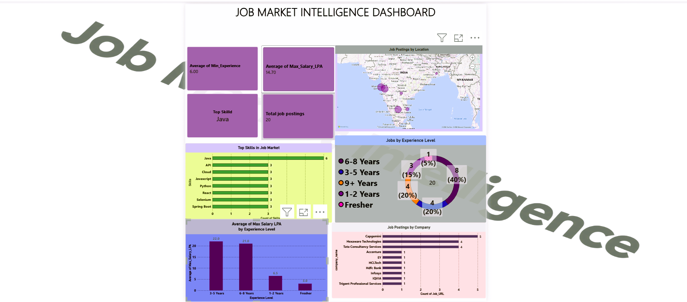
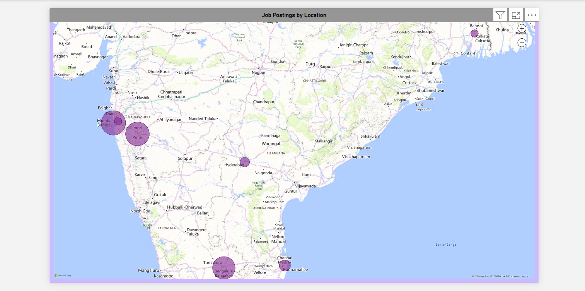
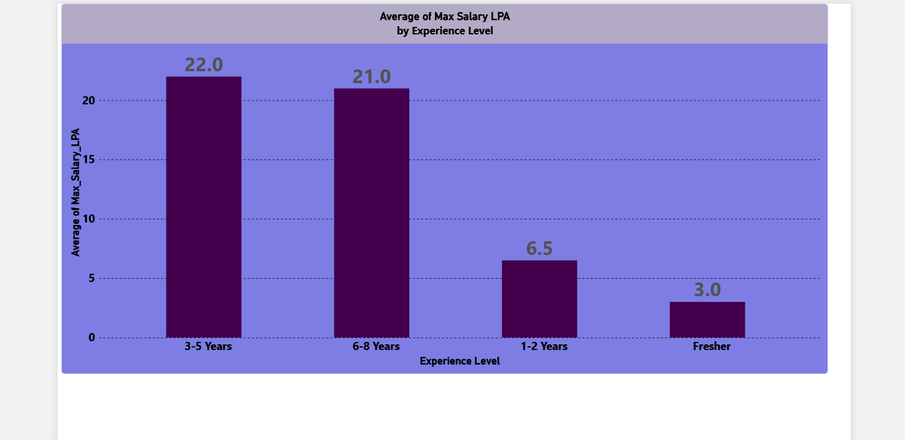
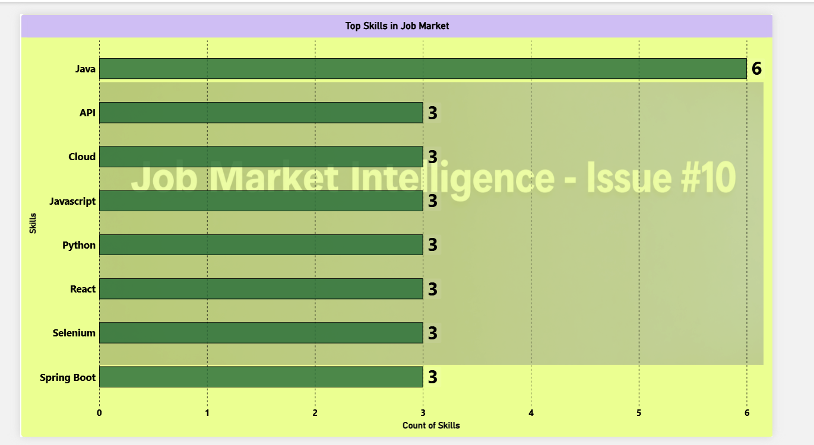
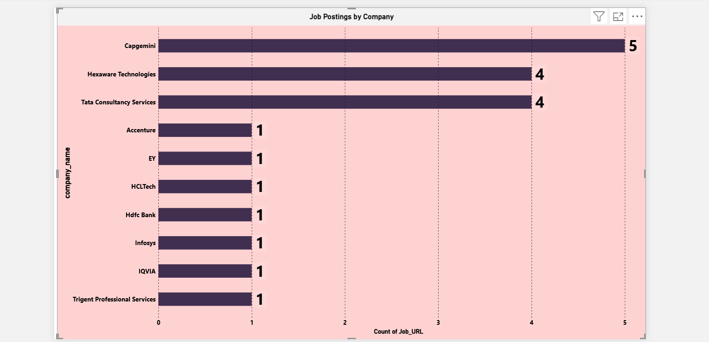

# 📊 Job Market Intelligence

A Python-based data analytics project that scrapes job postings from Naukri, cleans the data using Pandas, stores it in MySQL, and performs SQL-based job market analysis.

## 🚀 Project Overview

This project analyzes job market data to understand:

- Most demanded skills
- Companies hiring
- Job opportunities by location
- Salary ranges
- Experience requirements
- Fresher opportunities
- Job application links

## 🔄 Project Workflow

Naukri Website
→ Web Scraping
→ Data Cleaning
→ CSV Dataset
→ MySQL Database
→ SQL Analysis

## 🛠️ Technologies Used

- Python
- Selenium
- BeautifulSoup
- Pandas
- MySQL
- SQL
- Git & GitHub

## 📊 Power BI Dashboard

The cleaned job market data was visualized using Power BI to identify important job market trends and insights.

### Dashboard Preview



### Key Visualizations

#### 📍 Job Postings by Location


#### 💰 Salary Analysis


#### 💻 Top Skills in Job Market


#### 🏢 Jobs by Company


### Power BI File

The complete Power BI dashboard is available here:

[Download Power BI Dashboard](Job_Market_Intelligence.pbix)

## 📂 Project Structure

```text
job-market-intelligence/
│
├── webscraping.py
├── cleaning.py
├── database.py
├── analysis.sql
├── job_market_intelligence.csv
├── cleaned_job_market_intelligence.csv
├── README.md
└── .gitignore
